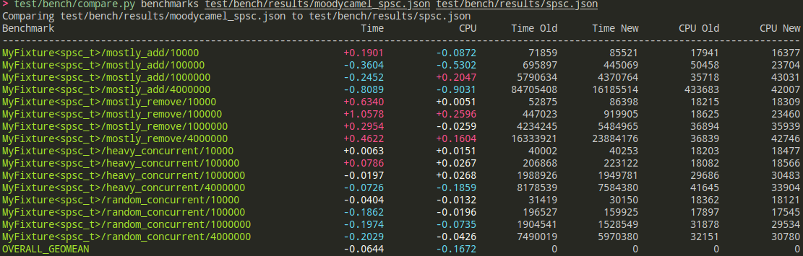

# spsc benchmarks {#bench_spsc}

## comprarison target
- [x] **moodycamel::readerwriterqueue** [blog](https://moodycamel.com/blog/2013/a-fast-lock-free-queue-for-c++) and [github](https://github.com/cameron314/readerwriterqueue)
- [x] **boost::lockfree::queue** [boost](https://www.boost.org/)

## command

### prepare

If you want to run accurate benchmarks, you should see some [tips](https://github.com/google/benchmark/blob/main/docs/user_guide.md#benchmarking-tips) from google benchmark.

If you use `xmake`, you can use the following command to prepare the benchmark data.
```bash
xmake f -m release -c --log_level=none
xmake build -vDg benchmarks/spsc
xmake run -vD bench_spsc --benchmark_format=json > test/bench/results/spsc.json
xmake run -vD bench_boost_spsc --benchmark_format=json > test/bench/results/boost_spsc.json
xmake run -vD bench_moodycamel_spsc --benchmark_format=json > test/bench/results/moodycamel_spsc.json
```

### compare


```bash
test/bench/compare.py benchmarks test/bench/results/boost_spsc.json test/bench/results/spsc.json
test/bench/compare.py benchmarks test/bench/results/moodycamel_spsc.json test/bench/results/spsc.json
```

## benchmark result

compare with `boost::lockfree::queue`


compare with `moodycamel::readerwriterqueue`

